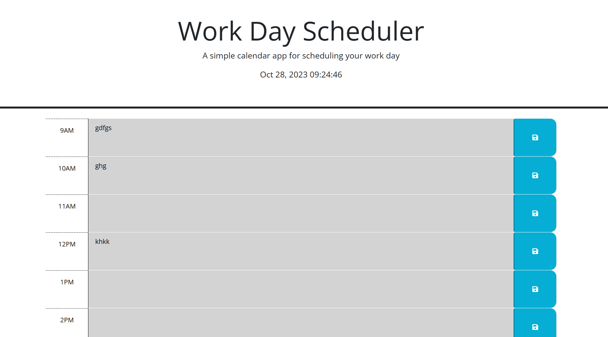

# Calander

## Description

calander is used for many purpeses. it can personal or work. this calander includes note with the time and date. 
this also deferenciats the future and past during the day. 
1. during past the colore if the nore becomes light color or gray.
2. during the present the color is red 
3. for the future it is green. 
this color code helps see the time differneces. this is important for saving to do list, that corrilate with the time. 

## Usage

when you planing your day, you also want to type what you want to do. so the note part you type what you want and then you save it. 
this is very simple to use. 

## Credits
Yacob Menghistu
https://github.com/YacobMn
also tutor help. 

## screenshot

## Features

bootstrap. 
